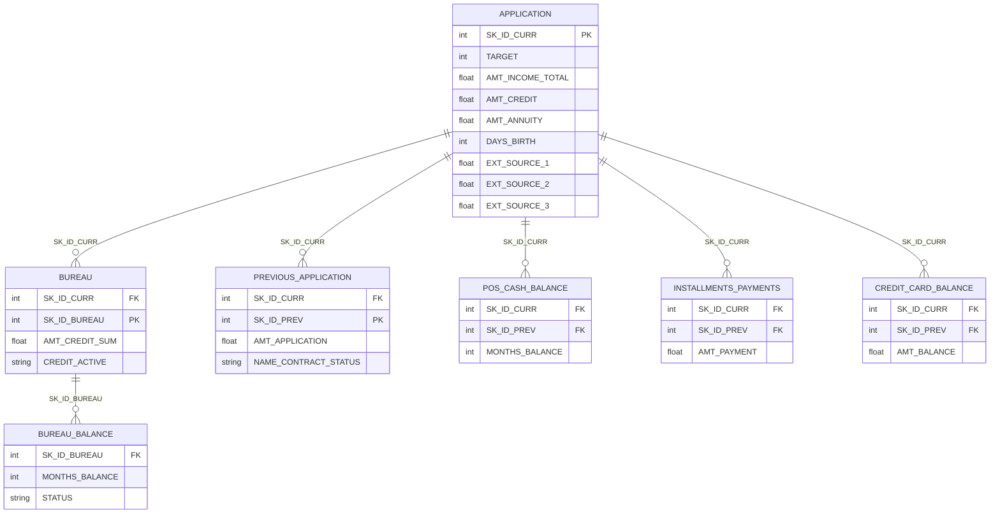

# System Architecture

This document gives a quick tour of how the Home Credit loan-default prediction
pipeline fits together.

## Data flow

```
+-----------------+      +----------------+      +-------------------+      +-------------+
| application_    | ---> | data_loader    | ---> | preprocessing     | ---> | model.fit   |
| train.csv       |      | (parquet cache,|      | (reduce/impute/   |      | (LR/RF/XGB) |
|                 |      |  fix sentinel) |      |  engineer/encode) |      |             |
+-----------------+      +----------------+      +-------------------+      +-------------+
                                                                                  |
                                                                                  v
                              +------------------+      +-------------------+
                              | evaluation       | <--- | model.predict     |
                              | (metrics, plots) |      +-------------------+
                              +------------------+
                                       |
                                       v
                              +------------------+
                              | dashboard/app    |
                              | (Streamlit)      |
                              +------------------+
```

## Modules at a glance

* `src/data_loader.py` reads `application_train.csv` once, caches it as parquet,
  and replaces the `DAYS_EMPLOYED == 365243` sentinel with NaN.
* `src/preprocessing.py` engineers six credit-risk ratios, reduces the columns
  (drops the id, ≥60%-missing columns and `FLAG_DOCUMENT_*`), then median/mode
  imputes, scales and one-hot encodes inside a sklearn `ColumnTransformer`.
  Numeric vs categorical columns are selected by dtype at fit time.
* `src/models/*.py` train one classifier each, save with `joblib`, and write
  confusion-matrix + ROC plots to `reports/figures/`.
* `src/evaluation.py` provides the shared metric/plot/K-fold helpers so all
  three model scripts produce consistent output.
* `dashboard/app.py` loads the saved models and exposes the overview,
  comparison, and live-prediction pages via Streamlit.

## Entity-relationship diagram (relational schema)

The dataset is relational. The application table is the parent; the other tables
join on `SK_ID_CURR` (and `bureau`↔`bureau_balance` on `SK_ID_BUREAU`). The
single-table model uses only `application`; the optional extension aggregates the
children per `SK_ID_CURR`. Render the diagram below (Mermaid) for the report:



## Preprocessing flow (Week-4 steps)

```
clean_data (dedupe + report missing)
   -> engineer_features (6 credit-risk ratios)
   -> select_feature_columns (drop id, >=60% missing, FLAG_DOCUMENT_*)
   -> ColumnTransformer:
        numeric  -> SimpleImputer(median)        -> StandardScaler
        category -> SimpleImputer(most_frequent) -> OneHotEncoder(ignore unknown)
   -> stratified_split (80/20, preserves the 8% default rate)
```

## Post-training optimisation

`src/optimisation.py` (driven by `optimise_models.py`) adds the
"measure and optimise" layer on top of the trained pipelines:

* decision-threshold sweep on the hold-out, with the F1-maximising cut-off per
  model (`reports/threshold_metrics.csv`, `reports/figures/threshold_sweep.png`);
* calibration (reliability) curves and Brier scores, evidencing why the
  dashboard reports percentile risk bands instead of raw probabilities;
* measured fit/predict wall-clock times next to each model's asymptotic
  training cost (`reports/complexity_timings.csv`);
* native global feature importances per model
  (`outputs/tables/feature_importance.csv`, `reports/figures/feature_importance.png`).

> The PNG diagrams in `04_Diagrams/System_Diagrams/` (ERD, DFD L0/L1, UML,
> preprocessing flowchart) are generated from
> `06_Working_Files/build_diagrams_homecredit.py` and reflect this Home Credit
> pipeline.
